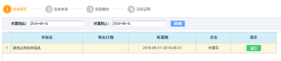
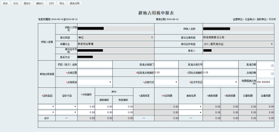
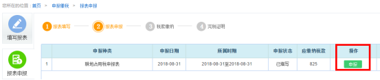

【模块说明】
平台针对占用耕地建房或从事其他非农业建设的单位和个人征收的税进行申报。
【进入路径】
首页→〖申报缴税〗→〖填写报表〗→〖耕地占用税〗→填写
【操作步骤】
纳税人选择该申报表进行填写，会自动弹出填写界面，如图。

进入填写界面，据实填写相关栏次，如需增加或删除行次，可通过屏幕左上方的“增行”或“删行”按钮操作，录入完成后可点击“保存”按钮，并确认保存，如图。

确认数据无误保存后，点击“报表申报”进行申报，点击‘刷新’按钮查看申报回执状态，如图。

