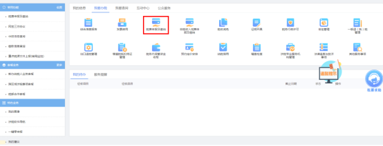
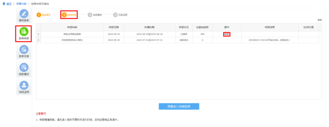

一、功能概述
2019年9月1日起，《中华人民共和国耕地占用税法》正式施行。电子税务局根据最新政策对申报表进行调整。　
占用耕地、园地、林地、草地、农田水利用地、养殖水面、渔业水域滩涂以及其他农用地建设建筑物、构筑物或者从事非农业建设的，依照占用耕地的标准征收耕地占用税。
二、进入路径
首页→〖用户登录〗→〖我要办税〗→〖税费申报及缴纳〗→〖耕地占用税申报表〗
三、操作步骤
1.登录山西省电子税务局，在〖税费申报及缴纳〗模块选择耕地占用税申报表。


2.报表填写：点击耕地占用税申报进入报表填写界面，点击“填写”按钮可进行申报表填写。

可根据实际情况点击“增加行”、“删除行”按钮进行增加或删除，填写完毕后点击“保存”按钮进行报表保存。

报表保存后，可点击“查改”“删除”按钮对报表进行修改或删除。

3.报表申报：报表保存后，点击左侧“报表申报”进入申报界面，点击“申报”，根据系统提示操作即可完成报表申报，通过点击右上方的“刷新”按钮，可查看申报结果。当申报结果为“申报成功”则申报表已传至税务机关核心征管系统。
